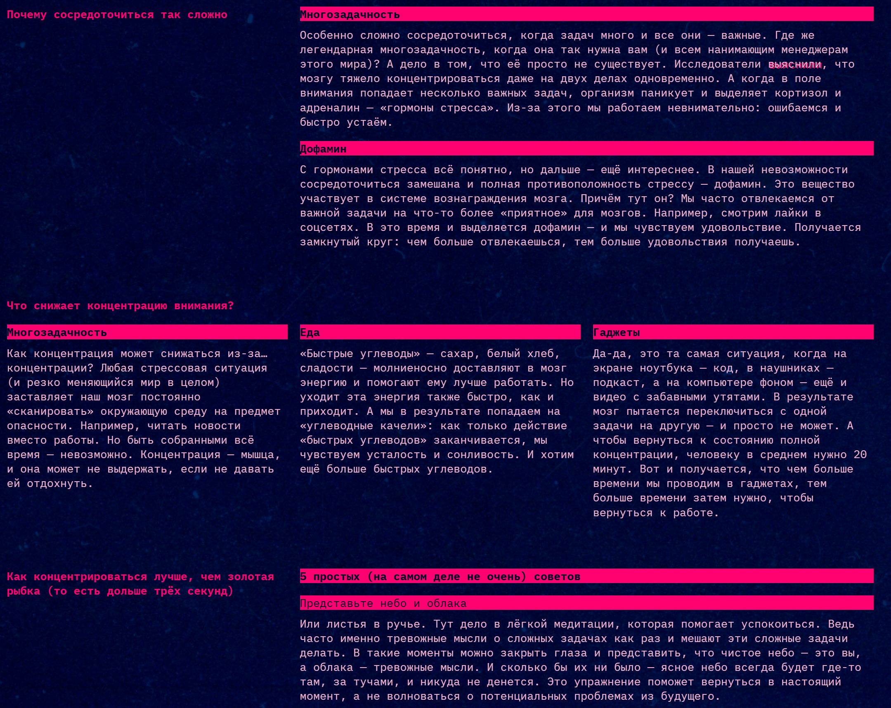

https://github.com/lamayade/slozhno-sosredotochitsya-fd.git

# No focus
## Сайт о состоянии сосредоточенности
Проект страницы сайта о причинах отсутствия сосредоточенности и способах её повышения. Реализовано адаптивное разрешение для мобильного устройства, планшета и десктопа. Поддерживается ночная тема.

## Технологии
__HTML__  
__CSS__  
__JavaScript__

## Как развернуть проект локально
Форкнуть и клонировать репозиторий:

```bash
git clone https://github.com/ваш_логин_на_гитхабе/slozhno-sosredotochitsya-fd.git
```

Перейти в папку проекта:

```bash
cd slozhno-sosredotochitsya-fd
```

Открыть файл `index.html` в браузере.

## Скриншоты

